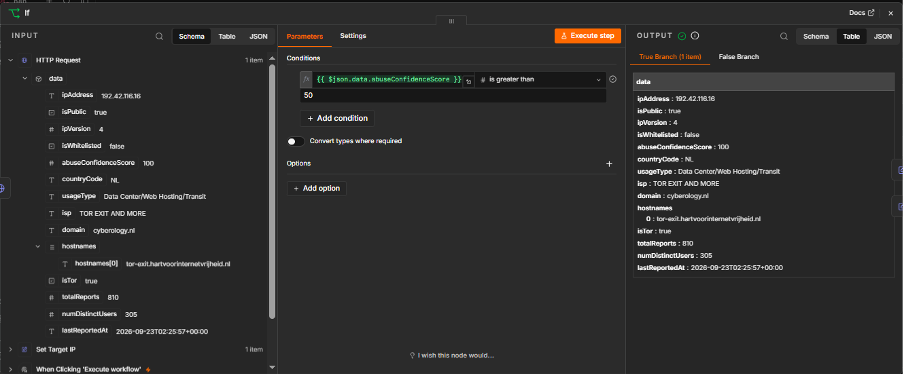
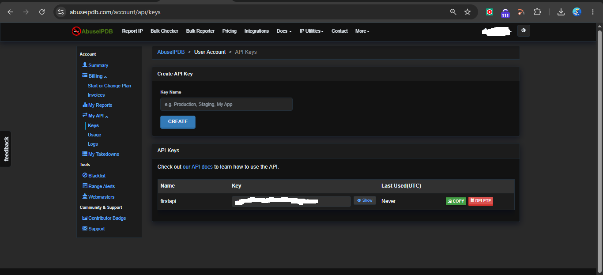
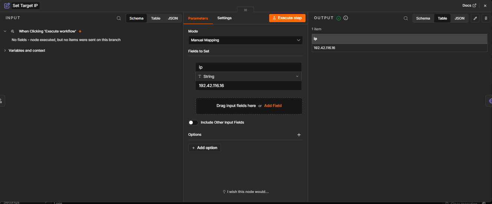
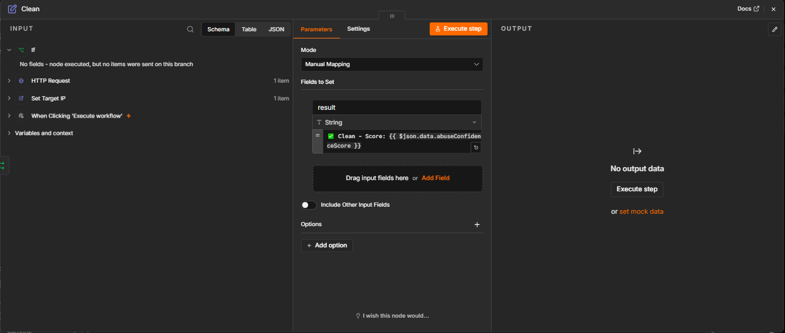
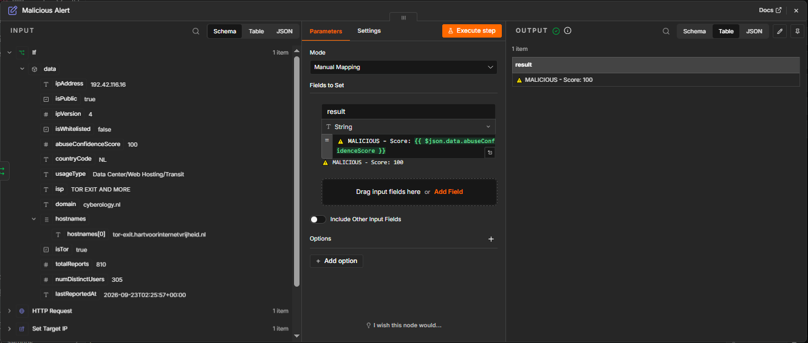
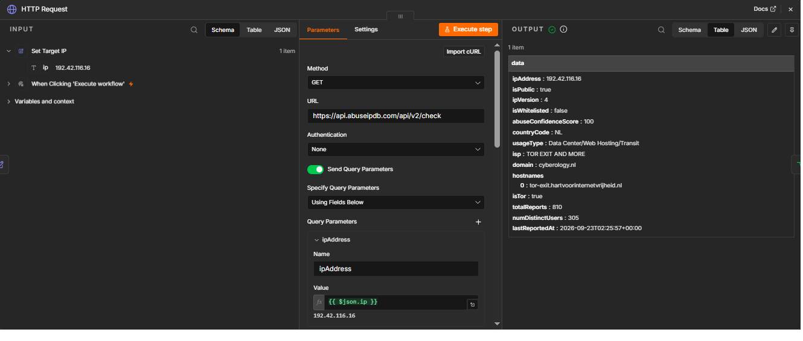
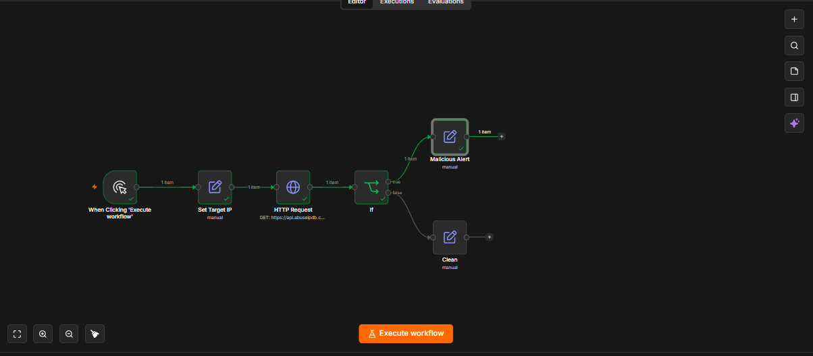

# n8n SOC Automations

Automation workflows built in [n8n](https://n8n.io) for SOC/security tasks — drag-and-drop nodes wired to real threat-intel APIs. No heavy coding required; each workflow is import-ready.

---

## 📁 Repo Structure

```
n8n-soc-automations/
├── IP Reputation Checker.json     # Importable n8n workflow
├── README.md
└── screenshorts/                  # Setup screenshots referenced below
    ├── n8n1.png → n8n7.png
```

---

## 1️⃣ IP Reputation Checker

Checks any IP against [AbuseIPDB](https://www.abuseipdb.com) and branches into a Malicious or Clean alert based on abuse confidence score.

**Flow:**
```
Manual Trigger → Set Target IP → HTTP Request (AbuseIPDB) → IF (score > 50) → Malicious Alert / Clean
```

**Tools:** n8n, AbuseIPDB API (free tier)

**Sample output:**
| IP | Score | Result |
|---|---|---|
| `118.25.6.39` | 7 | `✅ Clean - Score: 7` |
| `192.42.116.16` (Tor exit) | 100 | `⚠️ MALICIOUS - Score: 100` |



---

## 🚀 Option A — Quick Setup (Import JSON)

1. Get a free AbuseIPDB API key: [abuseipdb.com/register](https://www.abuseipdb.com/register) → Account → API → Create Key

   

2. In n8n: **Workflow menu (`...`) → Import → From file** → select `IP Reputation Checker.json`
3. Open the **HTTP Request** node → paste your API key into the `Key` header value
4. Open **Set Target IP** node → set the IP you want to check
5. Click **Execute workflow**

---

## 🛠️ Option B — Full Manual Build (from scratch)

### Step 1: Trigger
Add node → **Manual Trigger**

### Step 2: Set Target IP
Add node → **Edit Fields (Set)** → rename to `Set Target IP`

| Field | Value |
|---|---|
| Mode | `Manual Mapping` |
| Name | ```ip``` |
| Value | ```118.25.6.39``` |
| Type | `String` |

### Step 3: HTTP Request
Add node → **HTTP Request**

| Field | Value |
|---|---|
| Method | `GET` |
| URL | ```https://api.abuseipdb.com/api/v2/check``` |

**Query Parameters** (mode: *Using Fields Below* — avoids JSON syntax errors):

| Name | Value |
|---|---|
| ```ipAddress``` | ```{{ $json.ip }}``` |
| ```maxAgeInDays``` | ```90``` |

**Headers** (mode: *Using Fields Below*):

| Name | Value |
|---|---|
| ```Key``` | ```YOUR_ABUSEIPDB_API_KEY``` |
| ```Accept``` | ```application/json``` |




### Step 4: IF node (branch logic)
Add node → **IF**

| Field | Value |
|---|---|
| Value 1 | ```{{ $json.data.abuseConfidenceScore }}``` |
| Type | `Number` |
| Operator | `is greater than` |
| Value 2 | ```50``` |



### Step 5: Malicious Alert (true branch)
Add node → **Edit Fields (Set)** on IF's **true** output → rename to `Malicious Alert`

| Name | Value |
|---|---|
| ```result``` | ```⚠️ MALICIOUS - Score: {{ $json.data.abuseConfidenceScore }}``` |

### Step 6: Clean (false branch)
Add node → **Edit Fields (Set)** on IF's **false** output → rename to `Clean`

| Name | Value |
|---|---|
| ```result``` | ```✅ Clean - Score: {{ $json.data.abuseConfidenceScore }}``` |



### Step 7: Test
Click **Execute workflow** → check output on whichever branch fired.

---

## ⚠️ Error Handling / Common Issues

| Problem | Cause | Fix |
|---|---|---|
| `The value in the "JSON Query Parameters" field is not valid JSON` | Used *JSON mode* without proper quotes/commas | Switch Query Params / Headers to **"Using Fields Below"** instead of JSON mode |
| `abuseConfidenceScore` always 0 for private IP | Used a `192.168.x.x` / `10.x.x.x` local IP | AbuseIPDB only has data on **public** IPs — use `curl ifconfig.me` to get your real public IP, or use a known test IP |
| IF node not branching correctly | Left comparison type as `String` instead of `Number` | Click the type icon next to the operator dropdown → select `Number` |
| No output shown after "Execute workflow" | Normal — n8n doesn't auto-open node output after a full run | Click the branch node (Malicious Alert / Clean) manually to inspect its output panel |
| 401/403 error from AbuseIPDB | Missing or wrong API key | Re-check `Key` header value — regenerate key at abuseipdb.com/account/api if needed |



---

## 🔮 Advanced Features (Roadmap)

- [ ] Replace **Malicious Alert** end node with a real **Telegram/Discord** notification node
- [ ] Swap **Manual Trigger** for a **Webhook** trigger so external tools/scripts can call this automatically
- [ ] Add a **Split In Batches / Loop** node to check a list of IPs at once
- [ ] Add a second lookup workflow for **file hash reputation** via VirusTotal API
- [ ] Log every check result to a Google Sheet / database node for historical tracking

---

## 🧑‍💻 Author

**Mudasir Zia** — Cybersecurity student, SOC Analyst track
GitHub: [CyberBros435](https://github.com/CyberBros435)
